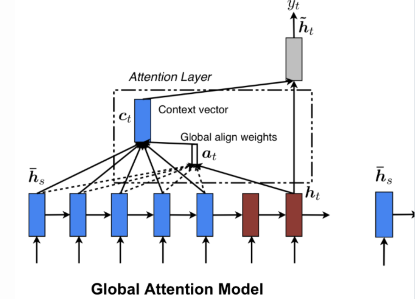

# attention mechanism

# ** Attention mechanism in keras **
This notbook tries to explain what often-quoted Attention mechanism is. we will discuss how a simple Attention model can be implemented in Keras. The purpose of this demo is to show how a simple Attention layer can be implemented in keras. The NLP field adressed here is sentiment analysis. The dataset is publically availble here

What is Attention?
When we think about the English word “Attention”, we know that it means directing your focus at something and taking greater notice. The Attention mechanism in Deep Learning is based off this concept of directing your focus, and it pays greater attention to certain factors when processing the data.

In broad terms, Attention is one component of a network’s architecture, and is in charge of managing and quantifying the interdependence:

Between the input and output elements (General Attention) Within the input elements (Self-Attention) Let me give you an example of how Attention works in a translation task. Say we have the sentence “How was your day”, which we would like to translate to the French version - “Comment se passe ta journée”. What the Attention component of the network will do for each word in the output sentence is map the important and relevant words from the input sentence and assign higher weights to these words, enhancing the accuracy of the output prediction.

    

